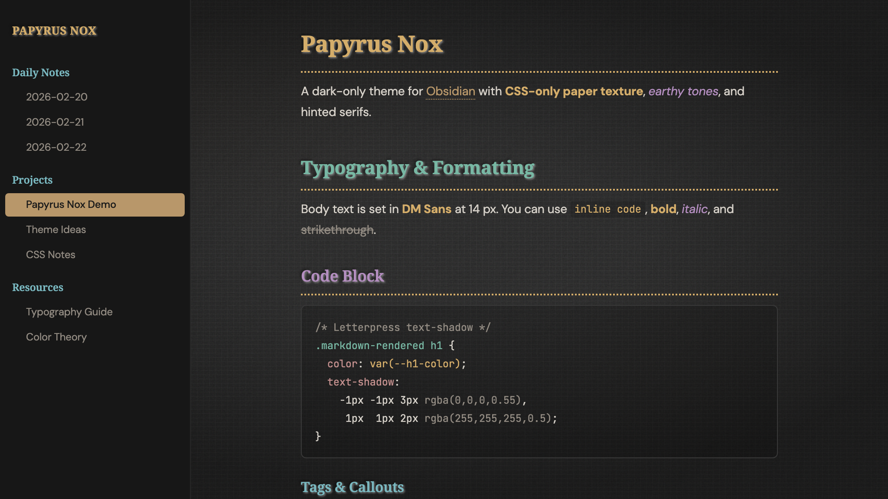

# Papyrus Nox

A dark-only theme for [Obsidian](https://obsidian.md) — aged paper texture, earthy tones, hinted serifs.

## Features

- **CSS-only paper texture** — layered SVG noise (feTurbulence + feDiffuseLighting), fiber lines, aging stains, and a deep vignette. No images required.
- **Earthy heading palette** — gold, teal, mauve, cyan, rosé, and taupe across H1–H6, each with a letterpress text-shadow.
- **Narrow, screen-optimised body text** — DM Sans at 95 % font-stretch, 14 px, 1.75 line-height, max 550 px page width.
- **Dark flat sidebar** — distraction-free navigation without paper texture.
- **Dotted heading underlines** in H1 gold.
- **Accessible focus indicators** and print styles.

## Installation

### Manual
1. Download `theme.css` and `manifest.json`.
2. In your vault, create `.obsidian/themes/Papyrus Nox/`.
3. Place both files inside.
4. In Obsidian → Settings → Appearance → Theme, select **Papyrus Nox**.

### Community Themes (coming soon)
Once approved, search for *Papyrus Nox* in Settings → Appearance → Manage.

## Author

**Björn Kindler** — [kindler-webservices.de](https://www.kindler-webservices.de)

## License

[MIT](LICENSE)
